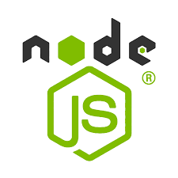
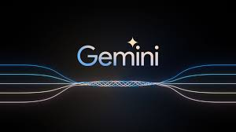

# FoodKaki
AngelHack

## Tech Track (Financial inclusion)
Problem statement: 
Singapore's aging population, coupled with rising living costs, poses a challenge for individuals to secure a financially secure retirement. DBS is looking for innovative tech solutions to empower this demographic and improve their retirement adequacy.

Solution:
FoodKaki is a budget tracking app which is able to let the user compare the prices between food bought from Fairprice and food delivered by Grab, to keep in line with the daily budget. This is so that our users may make a more informed decision regarding their food 

## Tech Stack

## Running our project
- npm install express

We require 2 command prompt terminal. Client and Server.
- Server
    - cd server
    - node server.js

- Client
    - npm run dev